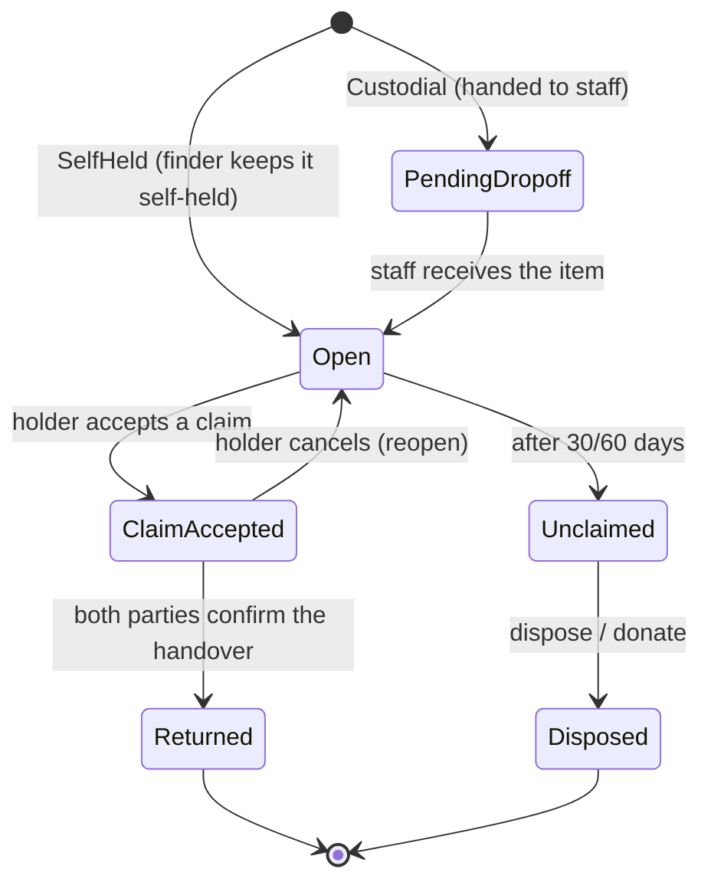
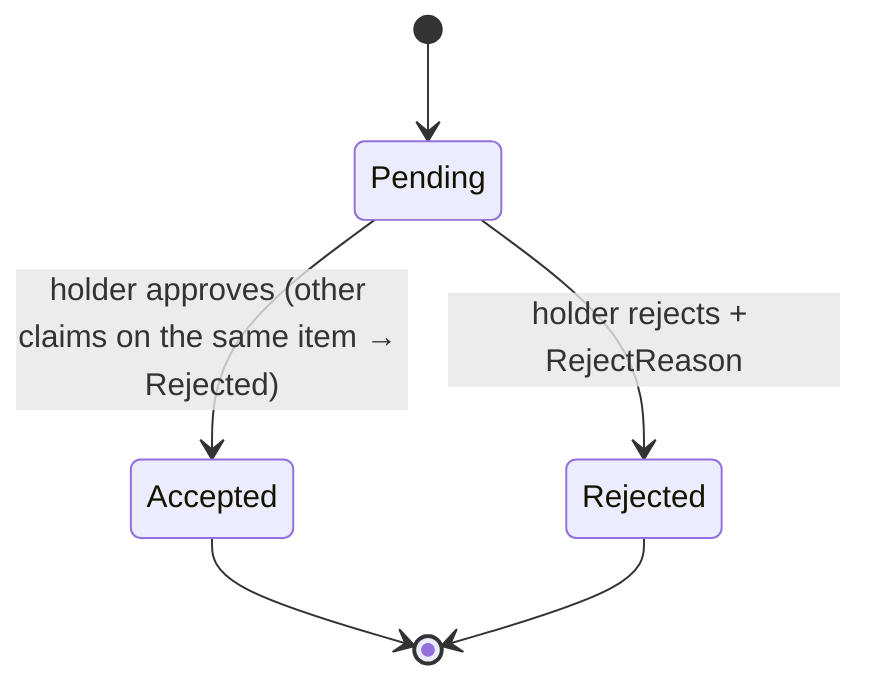
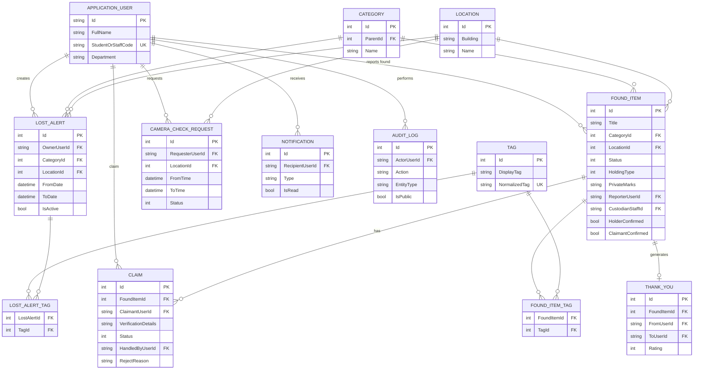

# Diagrams — State Machine & ERD

> Mermaid source kept in the repo (renders on GitHub / VS Code / mermaid.live). Edit it here, then re-sync the images in the report.

---

## 1. FoundItem Lifecycle

## 2. Claim Lifecycle

> `holder` = the finder if `SelfHeld`, = staff if `Custodial`. Disputes (multiple claims) → staff takes over to adjudicate.

---

## 3. ERD

